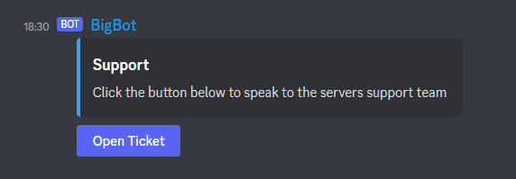

# [Nom Industries](https://nomindustries.com/bigbot/support)

<h2 id="services"> Our Services </h2>

- [BigBot Discord Bot](#bigbot)

<h1 id="bigbot"> <u>BigBot</u> </h1>

<h2 id="bigbot-features"> Features </h2>

- [Support](#bigbot-support-system)
- Server
- Role
- Moderation
- Misc
- Games
- Economy
- PrivateVoiceChannels
- Stickymessage
- Music
- Suggestions
- User
- Fun
- Internet
- Giveaways
- Admin
- EmbedManager
- Reactionroles
- Logging
- Welcomer
- Autoroles
- Threads

<h2 id="bigbot-coming-soon"> Coming Soon </h2>

- Accepting/Denying Suggestions
- Notifications
- Levelling System
- Loads of economy stuff

<h2 id="bigbot-links"> Links </h2>

- [Invite](https://nomindusties.com/bigbot/invite)
- [Support](https://nomindustries.com/bigbot/support)
- [Top.gg Vote](https://nomindustries.com/bigbot/support)
- [Trello](https://nomindustries.com/bigbot/trello)

<h2 id="bigbot-support-system"> Support System </h2>

<h3 id="bigbot-support-system-overview"> Overview </h3>

BigBot's support system is a ticket system that allows you to create panels in channels so users can create tickets via that panel.

Users click a button on a message like this image:

A ticket is then create like this image:

Your staff team can then help the user with whatever they are struggling with

<h3 id="bigbot-support-system-setup"> Setup </h3>

Soon
