<h1 id="bigbot"> <u>BigBot</u> </h1>

<h2 id="bigbot-features"> Features </h2>

- [Support](#bigbot-support-system)
- [Suggestions](#bigbot-suggestion-system)
- Server
- Role
- Moderation
- Misc
- Games
- Economy
- PrivateVoiceChannels
- Stickymessage
- Music
- User
- Fun
- Internet
- Giveaways
- Admin
- EmbedManager
- Reactionroles
- Logging
- Welcomer
- Autoroles
- Threads

<h2 id="bigbot-coming-soon"> Coming Soon </h2>

- Notifications
- Levelling System
- Loads of economy stuff

<h2 id="bigbot-links"> Links </h2>

- [Invite](https://nomindusties.com/bigbot/invite)
- [Support](https://nomindustries.com/bigbot/support)
- [Top.gg Vote](https://nomindustries.com/bigbot/support)
- [Trello](https://nomindustries.com/bigbot/trello)

<h2 id="bigbot-support-system"> Support System </h2>

<h3 id="bigbot-support-system-overview"> Overview </h3>

BigBot's support system is a ticket system that allows you to create panels in channels so users can create tickets via that panel.

Users click a button on a message like this image:  
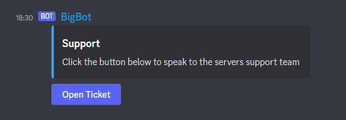

A ticket is then create like this image:  
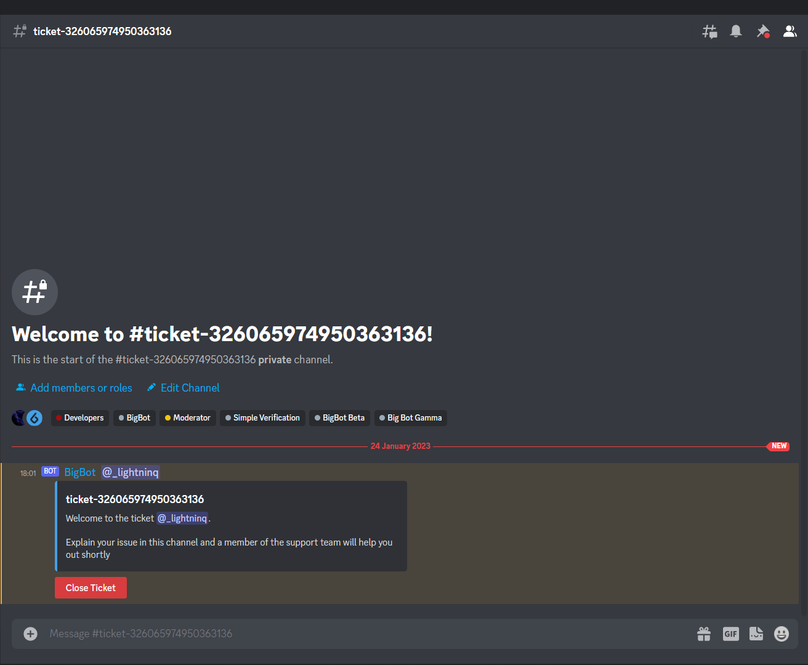

Your staff team can then help the user with whatever they are struggling with

<h3 id="bigbot-support-system-setup"> Setup </h3>

Interactive Setup Soon

<h2 id="bigbot-suggestion-system"> Suggestion System </h2>

<h3 id="bigbot-suggestion-system-overview"> Overview </h3>

BigBot's suggestion system comes in 3 different modes:
- Simple - All messages sent in a channel with have a ✅ and ❎ reaction add to them
- Embedded - All messages sent in a channel will be deleted and the content of them will be set as the embed description. A ✅ and ❎ will then be added to the new message
- Complex - All messages sent in a channel will be deleted and the content of them will be set as an embed description. The suggestion will then be given its own ID along with an upvote, downvote and settings button. The upvote and downvote buttons will allow users to submit their thoughts on the suggestion and the settings button will allow the original suggestion creator to edit or delete their suggestions. The settings button will also allow staff to accept, deny or delete suggestions

Users will send a message to a channel and the following will happen based on what system you have selected:

- If the simple system is selected the message will be given a ✅ and ❎ reaction as shown in this image  
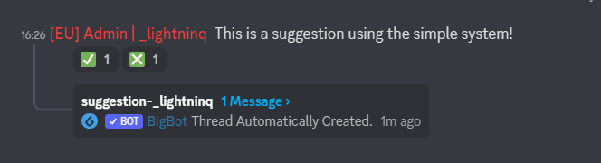
- If the embedded system is selected the message will be deleted and an embed will be sent with the suggestion as the description. The message will be given a ✅ and ❎ as shown in this image  
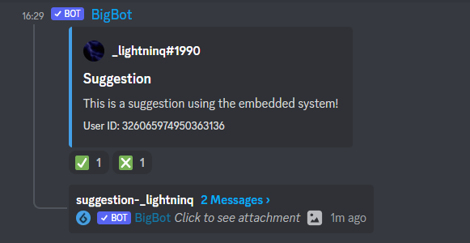
- If the complex system is selected the message will be deleted and an embed will be sent with the suggestion as the description. The message will have an upvote, downvote and settings button added to it as shown in this image  
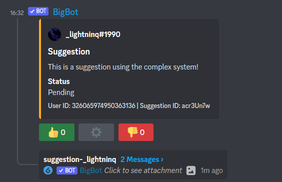

- If the complex system is chosen staff can then click the settings button to accept/deny/delete the suggestion.

<h3 id="bigbot-support-system-setup"> Setup </h3>

1. Run the `/suggestion config` command on the bot.
2. Click the `create new suggestion channel` button on the message sent as show in this image  
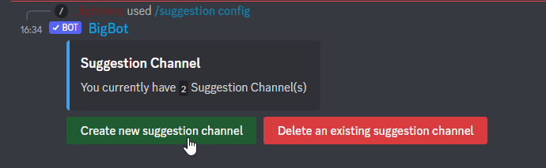
3. Select the channel you want to add as a suggestion channel as shown in this image  
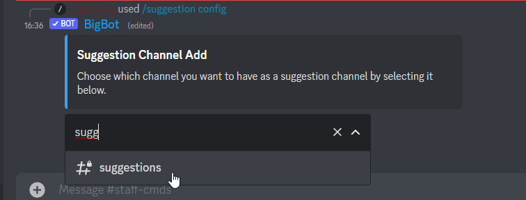
4. Select what type of suggestion channel you want as shown in this image. The different types are explained [above](#bigbot-suggestion-system-overview)
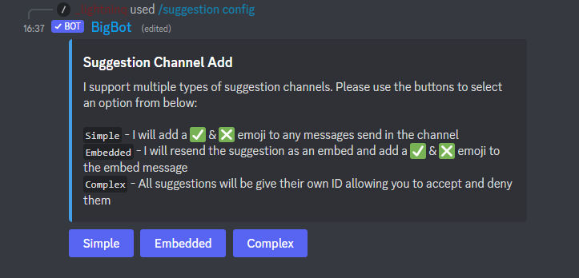  
5. Choose whether you want to automatically create a thread on new suggestions as shown in this image  
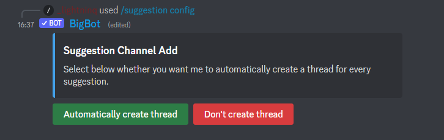
6. You are finished if you chose either `simple` or `embedded` in step 4. If you chose complex, however, you have one more step. You need to select whether you want to have accepted/denied suggestions be sent to seperate channels or just have the original message editted to show the verdict as shown in this image  
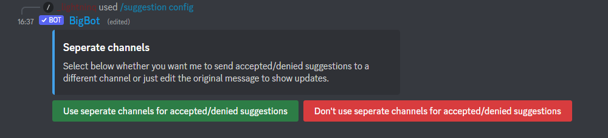
7. If you chose to send them to seperate channels you will then need to select an accepted suggestion channel and a denied suggestion channel as shown in this image  
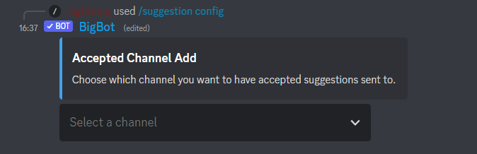
8. Done! Members can now suggest things by typing a message into the suggestion channel.  
